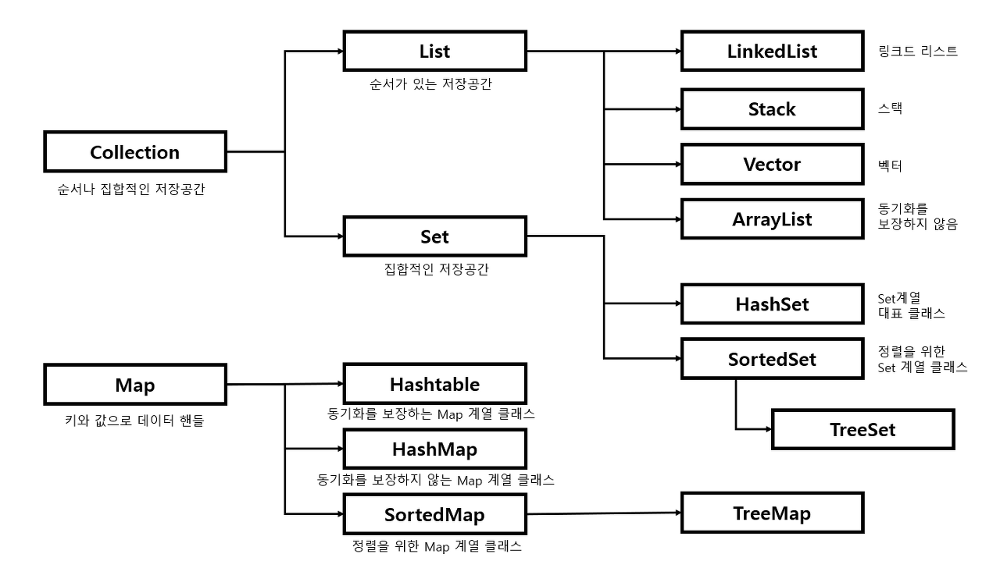

## 자료구조 (Data Structing)

배열을 이용하면 하나의 변수명으로 100개의 데이터를 처리할 수 있게 됨

자료구조는 컴퓨터 프로그램에서 데이터를 처리하기 위해 만든 자바구조  
[Array, List, Map]  
[Tuple, Dictionary]

### 배열(Array)
데이터를 순차적으로 지정해 0부터 시작하는 **인덱스**를 통해 접근할 수 있다

- 크기가 고정
- ArrayList arr = new ArrayList<String>
- 데이터를 순차적으로 접근할 수 있어 위치를 모르는 경우 효율이 떨어짐
- 배열에 들어가는 데이터는 모두 동일한 자료형이여야 한다.
- 배열 중간에 값을 추가하려면 기존 데이터를 모두 이동

### 리스트(List)

순차적인 자료구조를 제공

데이터 접근을 위해 인덱스를 사용해야 하는 점은 배열과 똑같다.

배열과의 차이점
- 데이터 크기가 고정되지 않음
- 데이터를 다루기 위한 여러 방법이 제공
- 리스트의 데이터는 서로 다른 타입일 수 있다 -> 일관된 처리를 하기 위해서는 동일하게 타입 처리
- 배열 중간에 값을 추가하거나 삭제하기 쉬움
- 특정 데이터가 포함되어 있는지 확인은 가능하나 검색을 위해서는 별도 구현이 필요

## 맵(map)

데이터를 (Key, Value) 쌍으로 지정하는 방식

장점
- 데이터를 지정할 때 해당 데이터를 찾기 위한 key
- key 값을 알면 언제든 쉽게 데이터를 찾을 수 있다
- Value에 객체형이 들어갈 수 있어 복잡한 데이터 처리가 가능하다.

## 이터레이터

서로 다른 자료구조(Vector, ArrayList, LinkedList)
- 동일한 방법으로 **다음 데이터** (next)에 접근하는 방법을 제공하는 인터페이스 자바 컬렉션 프레임워크의 일부

Collection
- List, Set (차이점 과제)
- Set
 - HashSet, SortedSet
 - SortedSet
  -TreeSet
- Map

=> 자바에서 데이터를 지정하는 클래스들을 표준화한 설계 자바구조

### List, Set, Map 차이

| 인터페이스 | 설명 | 특징          | 대표 구현 클래스 |
|-------|---|-------------|---|
| List  | 순서가 있는 데이터의 집합 | 데이터의 중복을 허용 | ArrayList, LinkedList |
| Set   | 순서를 유지하지 않는 데이터의 집합 | 데이터의 중복을 허용하지 않음 | HashSet, LinkedHashSet |
| Map   | 키와 값의 쌍으로 이루어진 데이터 집합 | 순서유지x, 키 중복x, 값 중복o | HashMap, LinkedHashMap |

### List
LinkedList
- 양방향 포인터 구조로 데이터 삽입, 삭제가 빠름
- ArrayList 보다 검색이 느림

ArrayList
- 단방향 포인터 구조로 데이터 순차적 접근에 강점
- 배열을 기반으로 데이터 저장
- 데이터 삽입, 삭제 느림
- 데이터 검색  빠름

### Set
- 빠른 검색 속도
- 인덱스가 존재하지 않기 때문에 iterator 사용

HashSet
- Null 값 허용

LinkedHashSet
- 입력된 순서를 보장

### Map
- 빠른 검색 속도
- 인덱스가 존재하지 않기 때문에 iterator 사용
- put, get, containsKey, remove, size, keySet
  - key에 값 없을 경우 null 리턴
  - key : 중복허용 X
  - value : 중복 허용 O

HashMap
- Key에 대한 중복이 없고 순서 보장 X
- Key, Value 값으로 null 허용
- 동기화가 보장되지 않음
- 검색에 가장 뛰어난 성능을 가짐
- key와 value를 묶어 하나의 entry 로 저장

LinkedHashMap
- 입력된 순서대로 데이터를 저장

TreeMap
- 입력된 key 의 오름차순 순서로 데이터 저장
  - 숫자 > 알파벳 대문자 > 알파벳 소문자 > 한글

#### Collection, Map 구조
